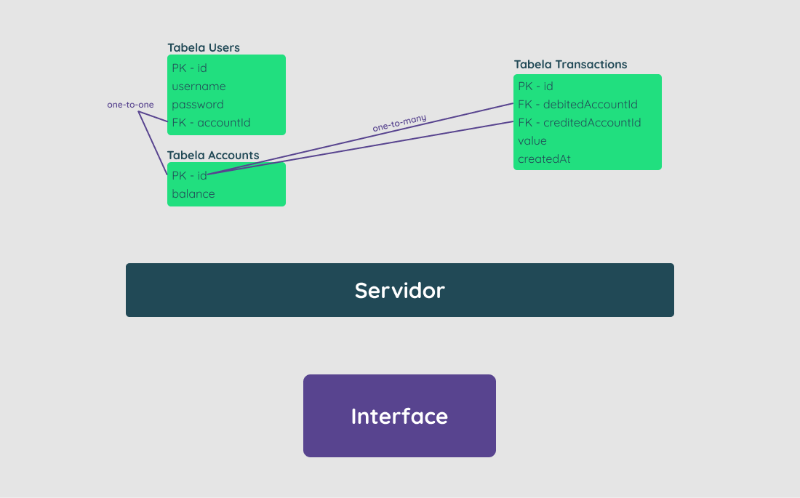
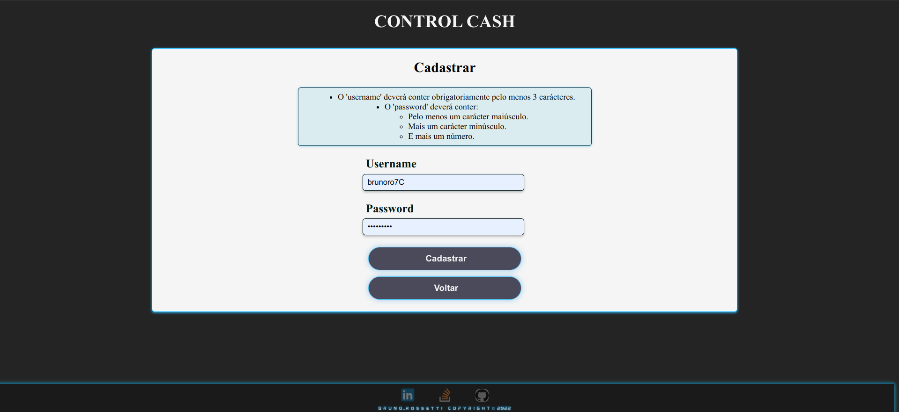
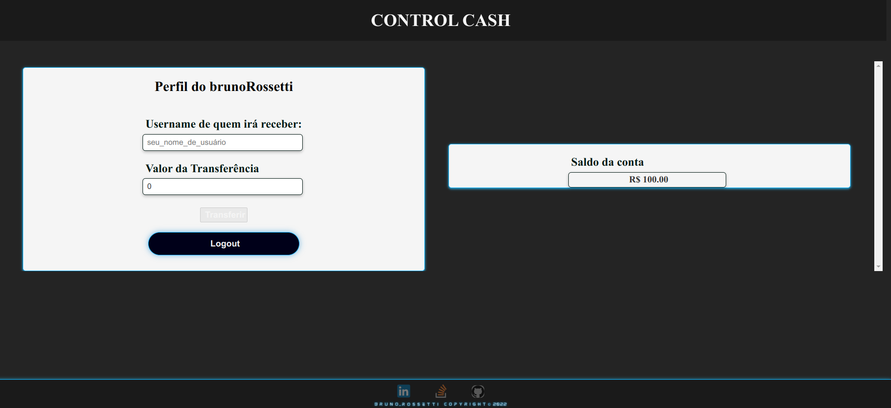
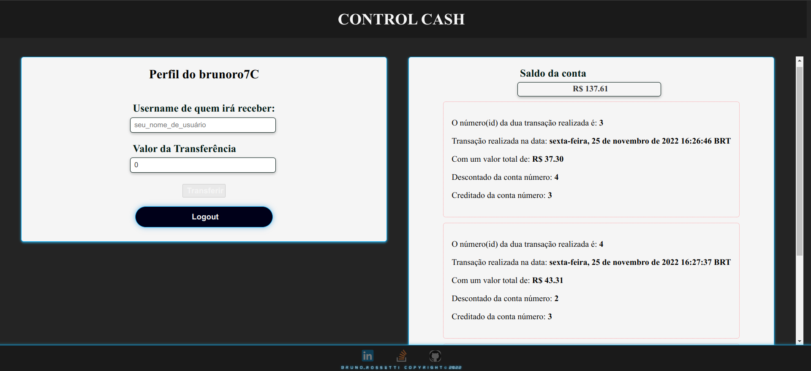
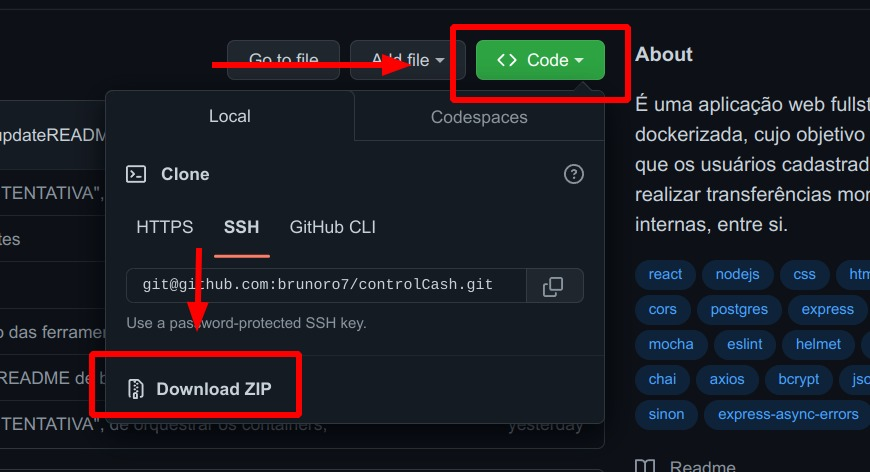

<div style="display:inline_block" align="center">

  <h1><strong>Control Cash</strong></h1>

</div>

<div style="display:inline_block" align="center">
  
  <h2><strong>Ideia do Projeto</strong></h2>
 
Este projeto foi desenvolvido e realizado por _[Bruno Ro7](https://www.linkedin.com/in/brunoro7/)_.<br>
É uma **aplicação web fullstack**, **dockerizada**, cujo **objetivo** é **possibilitar que os usuários** cadastrados na plataforma, consigam realizar transferências monetárias, internas, **entre si**.

---
</div>

## **Tecnologias usadas**

**Banco-de-Dados:**
> Desenvolvido usando: [**PostgreSQL**](https://www.postgresql.org/);

**Back-end:**
> Desenvolvido usando: [**Node.js**](https://nodejs.org), [**TypeScript**](https://www.typescriptlang.org/), [**Sequelize**](https://sequelize.org/), [**Sequelize-cli**](https://www.npmjs.com/package/sequelize-cli), [**Cors**](https://www.npmjs.com/package/cors), [**Helmet**](https://www.npmjs.com/package/helmet), [**Pg**](https://www.npmjs.com/package/pg), [**Dotenv**](https://www.npmjs.com/package/dotenv), [**Express**](https://www.npmjs.com/package/express), [**Express-async-errors**](https://www.npmjs.com/package/express-async-errors), [**Ts-node-dev**](https://www.npmjs.com/package/ts-node-dev), [**@types/cors**](https://www.npmjs.com/package/@types/cors), [**@types/express**](https://www.npmjs.com/package/@types/express), [**@types/node**](https://www.npmjs.com/package/@types/node), [**@types/pg**](https://www.npmjs.com/package/@types/pg), [**@types/sequelize**](https://www.npmjs.com/package/@types/sequelize), [**@types/bcrypt**](https://www.npmjs.com/package/@types/bcrypt), [**@types/jsonwebtoken**](https://www.npmjs.com/package/@types/jsonwebtoken), [**Bcrypt**](https://www.npmjs.com/package/bcrypt) e [**Jsonwebtoken**](https://www.npmjs.com/package/jsonwebtoken);

**Front-end:**
> Desenvolvido usando: [**Css**](https://pt.wikipedia.org/wiki/Cascading_Style_Sheets), [**Html**](https://pt.wikipedia.org/wiki/HTML), [**TypeScript**](), [**React**](https://reactjs.org/), [**React-router-dom**](https://www.npmjs.com/package/react-router-dom),[**Axios**](https://www.npmjs.com/package/axios), [**Dotenv**](https://www.npmjs.com/package/dotenv), [**@types/node**](https://www.npmjs.com/package/@types/node), [**@types/react**](https://www.npmjs.com/package/@types/react), [**@types/react-dom**](https://www.npmjs.com/package/@types/react-dom), [**axios**](https://www.npmjs.com/package/axios), [**Dotenv**](https://www.npmjs.com/package/dotenv), [**react-router-dom**](https://www.npmjs.com/package/react-router-dom) e [**@types/react-router-dom**](https://www.npmjs.com/package/@types/react-router-dom);

**Testes:**
> Desenvolvidos usando: [**Chai**](https://www.npmjs.com/package/chai), [**Chai-http**](https://www.chaijs.com/plugins/chai-http/), [**Mocha**](https://mochajs.org/), [**Sinon**](https://sinonjs.org/), [**EsLint**](https://eslint.org/), [**EsLint**](https://eslint.org/), [**Eslint-config-airbnb-base**](https://www.npmjs.com/package/eslint-config-airbnb-base), [**Eslint-config-airbnb-typescript**](https://www.npmjs.com/package/eslint-config-airbnb-typescript), [**Eslint-config-standard**](https://www.npmjs.com/package/eslint-config-standard), [**Eslint-plugin-editorconfig**](https://www.npmjs.com/package/eslint-plugin-editorconfig), [**Eslint-plugin-import**](https://www.npmjs.com/package/eslint-plugin-import), [**Eslint-plugin-mocha**](https://www.npmjs.com/package/eslint-plugin-mocha), [**Eslint-plugin-n**](https://www.npmjs.com/package/eslint-plugin-n), [**Eslint-plugin-promise**](https://www.npmjs.com/package/eslint-plugin-promise), [**Eslint-plugin-sonarjs**](https://www.npmjs.com/package/eslint-plugin-sonarjs), [**@types/chai**](https://www.npmjs.com/package/@types/chai), [**@types/mocha**](https://www.npmjs.com/package/@types/mocha), [**@types/sinon**](https://www.npmjs.com/package/@types/sinon), [**@typescript-eslint/eslint-plugin**](https://www.npmjs.com/package/@typescript-eslint/eslint-plugin), [**@typescript-eslint/parser**](https://www.npmjs.com/package/@typescript-eslint/parser) e [**@types/eslint**](https://www.npmjs.com/package/@types/eslint);

---
## **Arquitetura**

> <details>
> <summary><h4>Tabela <strong>Users</strong>:<h4></summary>
>
> - id ==> Primary-Key;
>
> - username ==> (o @ do usuário);
>
> - password ==> (com BCrypt - Hashed);
>
> - accountId ==> Foreign-Key (Accounts[id]);

</details>

> <details>
> <summary><h4>Tabela <strong>Accounts</strong>:<h4></summary>
>
> - id ==> primaryKey;
>
> - balance ==> No cadastro o valor é R$ 100,00;

</details>

> <details>
> <summary><h4>Tabela <strong>Transactions</strong>:<h4></summary>
>
> - id ==> PrimaryKey;
>
> - debitedAccountId ==> Foreign-Key (Accounts[id]);
>
> - creditedAccountId ==> Foreign-Key(Accounts[id]);
>
> - value ==> Total da transferência;
>
> - createdAt ==> Data de realização;

</details>

> <details>
> <summary><h4><strong>Diagrama</strong>:<h4></summary>
>
> 

</details>

---
<details>
<summary>

## **Regras de Negócio Back-End:**
</summary>

- [X] **1.** Qualquer pessoa deverá poder fazer parte, para isso, basta **realizar o cadastro** informando **"username"** e **"password"**.
- [X] **2.** Deve-se garantir que cada **"username"** seja **único** e composto por, **pelo menos, 3 caracteres**.
- [X] **3.** Deve-se garantir que a **"password"** seja composta por **pelo menos 8 caracteres**, **um número** e **uma letra maiúscula**. **Obs**: Lembre-se que ela deverá ser **"hashada"** ao ser armazenada no banco.
- [X] **4.** Durante o processo de **cadastro de um novo usuário**, sua respectiva conta deverá ser criada automaticamente na **tabela Accounts** com um **Balance de R$ 100,00**. **Obs**: É importante ressaltar que **caso ocorra algum problema** e o usuário não seja criado, a **tabela Accounts não deverá ser afetada**.
- [X] **5.** Todo usuário deverá conseguir logar na aplicação informando username e password. Caso o **login seja bem-sucedido**, um **token JWT (com 24h de validade)** deverá ser fornecido.
- [X] **6.** Todo **usuário logado** (ou seja, que apresente um token válido) deverá ser capaz de visualizar **seu próprio balance atual**. Um **usuário A não pode visualizar o balance de um usuário B**, por exemplo.
- [X] **7.** Todo **usuário logado** (ou seja, que apresente um token válido) deverá ser capaz de realizar um **cash-out** informando o **"username" do usuário** que sofrerá o **cash-in**, caso apresente **balance suficiente** para isso. Atente-se ao fato de que um usuário não deverá ter a possibilidade de realizar uma transferência para si mesmo.
- [X] **8.** Toda nova **transação bem-sucedida** deverá ser registrada na **tabela Transactions**. Em **casos de falhas** transacionais, a **tabela Transactions não deverá ser afetada**.
- [X] **9.** Todo **usuário logado** (ou seja, que apresente um token válido) deverá ser capaz de **visualizar as transações financeiras (cash-out e cash-in) que participou**. Caso o usuário não tenha participado de uma determinada transação, ele nunca poderá ter acesso à ela.
- [X] **10.** Todo **usuário logado** (ou seja, que apresente um token válido) deverá ser capaz de **filtrar as transações** financeiras que participou por:
  - [X] **-** **Data de realização** da transação;
  - [X] **-** Transações de **cash-out**;
  - [X] **-** Transações de **cash-in**;

</details>

---
<details>
<summary>

## **Regras de Negócio Front-End:**
</summary>

- [X] **1.** Página para realizar o cadastro informando **"username"** e **"password"**.
- [X] **2.** Página para realizar o login informando **"username"** e **"password"**.
- [X] **3.** Com o **usuário logado**, a **Página Principal** deve apresentar:
  - [X] **-** Balance atual (Saldo em conta) do usuário;
  - [X] **-** Seção voltada à realização de transferências para outros usuários, a partir do username de quem sofrerá o cash-in;
  - [X] **-** Tabela com os detalhes de todas as transações que o usuário participou;
  - [X] **-** Mecanismo para filtrar a tabela por data de transação e/ou transações do tipo cash-in/cash-out;
  - [X] **-** Botão para realizar o log-out;

</details>

---
<div  width="70vh" heigth="50vh" style="display:inline_block" align="center">

> ## **Layout Da Aplicação**

**Página de Login**  |  **Página de Cadastro**    
:-------------------------:|:-------------------------:
  |  

**Página Principal (Logado)**  |  **Página Principal c/ Transações (Logado)**    
:-------------------------:|:-------------------------:
  |  

**Developed by** - **BrunoRo7**

---
</div>

<div style="display:inline_block" align="center">

## **Observações mínimas para rodar o projeto:**

> ### **Precisa ter instalado em sua máquina o 'docker-compose'**
> Link de sugestão para fazer instalação, caso aconteça mais algum erro, por favor, entre em contato por uma das vias disponíveis nessa documentação.
>
> ==> https://www.digitalocean.com/community/tutorials/how-to-install-and-use-docker-compose-on-ubuntu-20-04-pt

> ### **Precisa ter instalado em sua máquina também o '**node**'**
> Link de sugestão para fazer instalação, caso aconteça mais algum erro, por favor, entre em contato por uma das vias disponíveis nessa documentação.
>
> ==> https://nodejs.org/pt-br/download/

</div>

---
## **Utilização do projeto:**
 
Para cada um dos passos, haverá um exemplo do comando a ser digitado para fazer o que está sendo pedido, caso tenha dificuldades e o exemplo não seja suficiente, sinta-se a vontade para me contatar em _[Bruno-Ro7 StackOverFlow](https://stackoverflow.com/users/20140542/bruno-rossetti)_.

**1.** Abra o terminal (também pode usar o atalho de teclado "**ctrl+alt+t**") e crie um diretório no local de sua preferência com o comando **mkdir**, aqui neste exemplo usaremos o nome "**projetos**":
```javascript
  mkdir projetos
```
> **obs**: lembrando que o nome **'projetos'**, que demos para o diretório, também poderia ser qualquer outro nome;

**2.** Entre no diretório que acabou de criar:
```javascript
  cd projetos
```

**3.** Faça o clone o projeto:
```javascript
  git clone git@github.com:brunoro7/controlCash.git
```
> **Obs: esse comando irá criar um novo diretório, já contendo toda a aplicação!**

**4.** Entre no diretório '**controlCash**', usando o comando abaixo:
```javascript
  cd controlCash
```

**05.** **Para Iniciar a Aplicação**, rode o comando abaixo:
```javascript
  docker-compose up -d --build
```
> **Para Finalizar a Aplicação:**
>```javascript
>  docker-compose down
>```
>
> **OBS:** Você pode usar a qualquer momento o comando acima para finalizar a aplicação, mas lembre-se que ao rodar esse comando, você irá perder todos os dados salvos no banco de dados até o momento!

---
<div style="display:inline_block" align="center">

### **Após realizar o comando do "item 05", seu aplicativo já estará funcionando no browser do seu navegador com o projeto rodando!**
> ## "Endereço" ==>  **http://localhost:3000/**

---
</div>

<details>
<summary>

### **Caso queira utilizar o projeto através do '.zip' :**
</summary>

### **Utilização do projeto:**

**1.** Faça o **download do .zip** do projeto no diretório de sua escolha, usando o botão '**Code**', mostrado na imagem:

  

**2.** Descompactar o **.zip** com a ferramenta de sua preferência, e acessar o diretório criado:
> **Obs: essa "pasta"/"diretório" irá conter as configurações da sua aplicação como um todo, restando apenas rodar o aplicativo e iniciar o banco de dados!**

Entre na "pasta"/"diretório", que foi extraída, com nome '**controlCash**'. 

**3.** Abra o terminal na raíz da aplicação, que é a "pasta"/"diretório" '**controlCash**':
> Você pode fazer isso usando o botão direito do mouse e clicando em abrir "pasta"/"diretório" no terminal.

**04.** **Para Iniciar a Aplicação**, rode o comando abaixo:
```javascript
  docker-compose up -d --build
```
> **Para Finalizar a Aplicação:**
>```javascript
>  docker-compose down
>```
>
> **OBS:** Você pode usar a qualquer momento o comando acima para finalizar a aplicação, mas lembre-se que ao rodar esse comando, você irá perder todos os dados salvos no banco de dados até o momento!

---
<div style="display:inline_block" align="center">

### **Após realizar o comando do "item 04", seu aplicativo já estará funcionando no browser do seu navegador com o projeto rodando!**
> ## "Endereço" ==>  **http://localhost:3000/**

</div>

</details>

---
<div style="display:inline_block" align="center">

**Copyright © 2022 Bruno Rossetti**

---
</div>