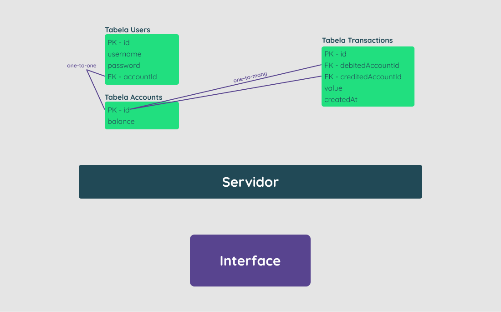

<div style="display:inline_block" align="center">

  <h1><strong>Control Cash</strong></h1>

</div>

<div style="display:inline_block" align="center">
  
  <h2><strong>Idéia do Projeto</strong></h2>
 
Este projeto foi desenvolvido e realizado por _[Bruno Ro7](https://www.linkedin.com/in/brunoro7/)_.<br>
É uma **aplicação web fullstack**, **dockerizada**, cujo **objetivo** é **possibilitar que os usuários** cadastrados na plataforma, consigam realizar transferências internas **entre si**.

---
</div>

## **Técnologias usadas**

**Banco-de-Dados:**
> Desenvolvido usando: [**PostgreSQL**](https://www.postgresql.org/);

**Back-end:**
> Desenvolvido usando: [**Node.js**](https://nodejs.org), [**TypeScript**](https://www.typescriptlang.org/), [**Sequelize**](), [**Cors**](https://www.npmjs.com/package/cors), [**Dotenv**](https://www.npmjs.com/package/dotenv), [**Express**](https://www.npmjs.com/package/express) e [**Express-async-errors**](https://www.npmjs.com/package/express-async-errors);

**Front-end:**
> Desenvolvido usando: [**Css**](https://pt.wikipedia.org/wiki/Cascading_Style_Sheets), [**Html**](https://pt.wikipedia.org/wiki/HTML), [**TypeScript**](), [**React**](https://reactjs.org/), [**React-router-dom**](https://www.npmjs.com/package/react-router-dom),[**Axios**](https://www.npmjs.com/package/axios), [**Dotenv**](https://www.npmjs.com/package/dotenv) e [**Prop-types**](https://www.npmjs.com/package/prop-types);


**Testes:**
> Desenvolvidos usando: [**Chai**](https://www.npmjs.com/package/chai), [**Mocha**](https://mochajs.org/), [**Sinon**](https://sinonjs.org/);

---
## **Arquitetura**

> <details>
> <summary><h4>Tabela <strong>Users</strong>:<h4></summary>
>
> - id ==> Primary-Key;
>
> - username ==> (o @ do usuário);
>
> - password ==> (com BCrypt - Hashed);
>
> - accountId ==> Foreign-Key (Accounts[id]);

</details>

> <details>
> <summary><h4>Tabela <strong>Accounts</strong>:<h4></summary>
>
> - id ==> primaryKey;
>
> - balance ==> No cadastro o valor é R$ 100,00;

</details>

> <details>
> <summary><h4>Tabela <strong>Transactions</strong>:<h4></summary>
>
> - id ==> PrimaryKey;
>
> - debitedAccountId ==> Foreign-Key (Accounts[id]);
>
> - creditedAccountId ==> Foreign-Key(Accounts[id]);
>
> - value ==> Total da transferência;
>
> - createdAt ==> Data de realização;

</details>

> <details>
> <summary><h4><strong>Diagrama</strong>:<h4></summary>
>
> 

</details>

---
<details>
<summary>

## **Regras de Negócio Back-End:**
</summary>

- [ ] **1.** Qualquer pessoa deverá poder fazer parte, para isso, basta **realizar o cadastro** informando **"username"** e **"password"**.
- [ ] **2.** Deve-se garantir que cada **"username"** seja **único** e composto por, **pelo menos, 3 caracteres**.
- [ ] **3.** Deve-se garantir que a **"password"** seja composta por **pelo menos 8 caracteres**, **um número** e **uma letra maiúscula**. **Obs**: Lembre-se que ela deverá ser **"hashada"** ao ser armazenada no banco.
- [ ] **4.** Durante o processo de **cadastro de um novo usuário**, sua respectiva conta deverá ser criada automaticamente na **tabela Accounts** com um **Balance de R$ 100,00**. **Obs**: É importante ressaltar que **caso ocorra algum problema** e o usuário não seja criado, a **tabela Accounts não deverá ser afetada**.
- [ ] **5.** Todo usuário deverá conseguir logar na aplicação informando username e password. Caso o **login seja bem-sucedido**, um **token JWT (com 24h de validade)** deverá ser fornecido.
- [ ] **6.** Todo **usuário logado** (ou seja, que apresente um token válido) deverá ser capaz de visualizar **seu próprio balance atual**. Um **usuário A não pode visualizar o balance de um usuário B**, por exemplo.
- [ ] **7.** Todo **usuário logado** (ou seja, que apresente um token válido) deverá ser capaz de realizar um **cash-out** informando o **"username" do usuário** que sofrerá o **cash-in**, caso apresente **balance suficiente** para isso. Atente-se ao fato de que um usuário não deverá ter a possibilidade de realizar uma transferência para si mesmo.
- [ ] **8.** Toda nova **transação bem-sucedida** deverá ser registrada na **tabela Transactions**. Em **casos de falhas** transacionais, a **tabela Transactions não deverá ser afetada**.
- [ ] **9.** Todo **usuário logado** (ou seja, que apresente um token válido) deverá ser capaz de **visualizar as transações financeiras (cash-out e cash-in) que participou**. Caso o usuário não tenha participado de uma determinada transação, ele nunca poderá ter acesso à ela.
- [ ] **10.** Todo **usuário logado** (ou seja, que apresente um token válido) deverá ser capaz de **filtrar as transações** financeiras que participou por:
  - [ ] **-** **Data de realização** da transação;
  - [ ] **-** Transações de **cash-out**;
  - [ ] **-** Transações de **cash-in**;

</details>

---
<details>
<summary>

## **Regras de Negócio Front-End:**
</summary>

- [ ] **1.** Página para realizar o cadastro informando **"username"** e **"password"**.
- [ ] **2.** Página para realizar o login informando **"username"** e **"password"**.
- [ ] **3.** Com o **usuário logado**, a **Página Principal** deve apresentar:
  - [ ] **-** Balance atual (Saldo em conta) do usuário;
  - [ ] **-** Seção voltada à realização de transferências para outros usuários, a partir do username de quem sofrerá o cash-in;
  - [ ] **-** Tabela com os detalhes de todas as transações que o usuário participou;
  - [ ] **-** Mecanismo para filtrar a tabela por data de transação e/ou transações do tipo cash-in/cash-out;
  - [ ] **-** Botão para realizar o log-out;

</details>

---
<div  width="70vh" heigth="50vh" style="display:inline_block" align="center">

> ## **Layout Da Aplicação**

**Página de Login**  |  **Página de Cadastro**    
:-------------------------:|:-------------------------:
  |  

**Página Principal (Logado)**  |  **By BrunoRo7**    
:-------------------------:|:-------------------------:
  |  
<!-- https://avatars.githubusercontent.com/u/80050586?v=4 -->

---
</div>

## **Instalação do projeto localmente:**
 
Para cada um dos passos, haverá um exemplo do comando a ser digitado para fazer o que está sendo pedido, caso tenha dificuldades e o exemplo não seja suficiente, sinta-se a vontade para me contatar em _[Bruno-Ro7 StackOverFlow](https://stackoverflow.com/users/20140542/bruno-rossetti)_.

1. Abra o terminal (também pode usar o atalho de teclado "**ctrl+alt+t**") e crie um diretório no local de sua preferência com o comando **mkdir**, aqui neste exemplo usaremos o nome "**projetos**":
```javascript
  mkdir projetos
```
> **obs**: lembrando que o nome **'projetos'**, que demos para o diretório, também poderia ser qualquer outro nome;

2. Entre no diretório que acabou de criar:
```javascript
  cd projetos
```

3. Faça o clone o projeto:
```javascript
  git clone "link do ssh do projeto"
```
> **Obs: esse comando irá criar um novo diretório, já contendo toda a sua aplicação!**

4. Entre no diretório '**nome-do-diretório**', usando o comando abaixo:
```javascript
  cd "destino do diretório"
```

5. Rode as instalações, específicas do frontend:
```javascript
  npm install
```

6. Inicie a aplicação:
```javascript
  npm start
```

<div style="display:inline_block" align="center">

### **Esse último script irá abrir o browser do seu navegador com o projeto rodando!**

---
</div>

<div style="display:inline_block" align="center">

**Adicionar o texto do copyright**

---
</div>